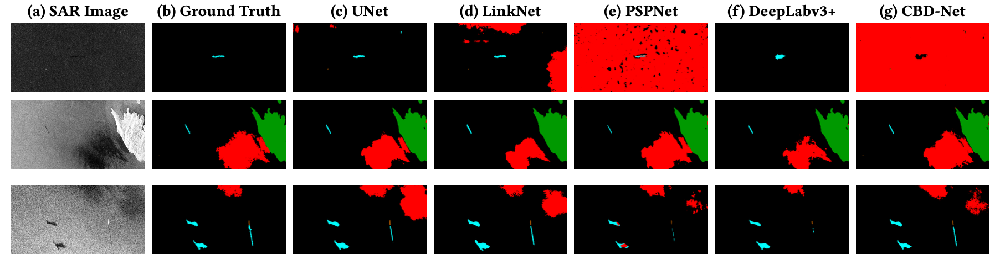

# Oil Spill Detection on SAR Images: Comparative Analysis of Five Segmentation Models


[](https://github.com/adsp-polito/2024-P11-SAR/commits/main)
[](https://github.com/adsp-polito/2024-P11-SAR/issues)
[](LICENSE)

The report covering all our findings can be found **[here](https://github.com/adsp-polito/2024-P11-SAR/blob/main/ADSP_SAR_Team10_AA2425.pdf)**.

## Contributors

This project was developed by:

- **[Bianca Bartoli](https://github.com/BiancaBartoli)**  
- **[Carlo Marra](https://github.com/CarloMarra)**  
- **[Alessandro Valenti](https://github.com/alesh-hub)** 

## Introduction

Marine oil pollution from human activities poses significant threats to ecosystems, endangering biodiversity and environmental stability. Prompt detection of oil spills is crucial for mitigating these impacts, and remote sensing technology plays a vital role in this effort. Synthetic Aperture Radar (SAR) imagery, such as that from the Copernicus Sentinel-1 mission, is particularly effective for oil spill detection due to its ability to operate under all weather and lighting conditions.

However, accurately distinguishing oil spills from similar-looking phenomena (known as "look-alikes") remains challenging. This project leverages deep learning-based semantic segmentation models to enhance the precision of oil spill detection in SAR images. We evaluate five models, U-Net, LinkNet, PSPNet, DeepLabv3+, and CBD-Net—on a dataset from the Copernicus Sentinel-1 mission. Our analysis highlights DeepLabv3+ as the most effective model, balancing accuracy and computational efficiency, while also exploring tailored training techniques to improve model robustness and generalization.

## Models

This project implements and compares five semantic segmentation models for oil spill detection in SAR images. Below is a list of each model, along with links to their respective papers.

| **Model**      | **Paper**                                                                                                             |
| -------------- | --------------------------------------------------------------------------------------------------------------------- |
| **U-Net**      | [U-Net: Convolutional Networks for Biomedical Image Segmentation](https://arxiv.org/abs/1505.04597)                   |
| **LinkNet**    | [LinkNet: Exploiting Encoder Representations for Efficient Semantic Segmentation](https://arxiv.org/abs/1707.03718)   |
| **PSPNet**     | [Pyramid Scene Parsing Network](https://arxiv.org/abs/1612.01105)                                                     |
| **DeepLabv3+** | [Encoder-Decoder with Atrous Separable Convolution for Semantic Image Segmentation](https://arxiv.org/abs/1802.02611) |
| **CBD-Net**    | [CBD-Net: Contextual and Boundary-supervised Detection Network](https://ieeexplore.ieee.org/document/9553884)         |

## Repository Structure

```
.
├── Checkpoints
│   ├── 1stCheckpoint
│   ├── 2ndCheckpoint
│   └── 3rdCheckpoint
├── extensions
│   └── results
│       ├── Deeplab_Focused
│       └── Deeplab_Sliding
├── material
│   └── model_papers
└── models
    └── results
        ├── CBDnet
        ├── Deeplabv3
        ├── LinkNet
        ├── PSPNet
        └── UNet
```

### Directory Breakdown


- **`Checkpoints/`**  
  - **Purpose:** Archives significant project milestones, reflecting key stages of progress and feedback.

- **`extensions/`**  
  - **Purpose:** Contains proposed training techniques and related evaluation results.  
  - **Contents:**
    - **`results/`:** Stores evaluation results images on the test set from experiments conducted within the `extensions` directory.

- **`material/`**  
  - **Purpose:** Contains useful papers and reference materials related to the semantic segmentation models and methodologies used in this project.  
  - **Contents:** Includes key literature that underpins the theoretical and practical approaches applied, such as foundational papers for each model and advanced segmentation techniques.

- **`models/`**  
  - **Purpose:** Contains training scripts and evaluation results for the five segmentation models utilized in the project.  
  - **Contents:**
    - **`results/`:** Stores evaluation results images on the test set for each of the five models.

## Dataset

Unfortunately, we are unable to make the dataset used in this project publicly available due to licensing restrictions. The dataset consists of Synthetic Aperture Radar (SAR) images from the Copernicus Sentinel-1 mission, which are governed by specific usage agreements.

## Usage

Our pre-trained models for **U-Net**, **LinkNet**, **PSPNet**, **DeepLabv3+**, and **CBD-Net** are available for download and can be used for your research. You can access the models through [this Google Drive folder](https://drive.google.com/drive/folders/17zHLLJ_VNzvi4MSB9jeTvwIExn-XAKuo?usp=drive_link).

Below are two methods for downloading and using the models:

### **Method 1: Manual Download**
1. Navigate to the [Google Drive folder](https://drive.google.com/drive/folders/17zHLLJ_VNzvi4MSB9jeTvwIExn-XAKuo?usp=drive_link).
2. Download the desired `.ckpt.zip` file to your local machine.
3. Extract the `.zip` file to get the `.ckpt` file.

Once the `.ckpt` file is ready, you can load and use the model in PyTorch as follows:

```Python
import torch

# Path to the extracted checkpoint file
model_path = "path_to_downloaded_model/checkpoint.ckpt"

# Load the model
model = torch.load(model_path)

# Set the model to evaluation mode
model.eval()

# Use the model for inference
output = model(input_tensor)
```

### Method 2: Programmatic Download with gdown

You can use the gdown library to download the models directly from Google Drive. Here’s an example:

```Python
# Install the gdown library if not already installed
# pip install gdown

import gdown

# Google Drive file URL (replace with the desired model's file ID)
url = "https://drive.google.com/uc?id=FILE_ID"

# Local path where the file will be saved
output = "checkpoint.ckpt.zip"

# Download the file
gdown.download(url, output, quiet=False)

# Unzip the file to extract the .ckpt file
import zipfile

with zipfile.ZipFile(output, 'r') as zip_ref:
    zip_ref.extractall("output_directory")

print("Model downloaded and extracted!")
```

After extracting the `.zip` file, you can load the model in PyTorch using the same process as in Method 1.

**Notes:**
- The models are implemented in PyTorch, making them easy to integrate into PyTorch-based workflows.
- For any questions, issues, or feature requests, please visit our repository's [Issues section](https://github.com/adsp-polito/2024-P11-SAR/issues). We are happy to assist and collaborate to improve your experience with the models.
- Input Format: All models accept only monochannel images (single-channel input). If your images are multi-channel (e.g., RGB), convert them to grayscale before using the models:

```Python
from PIL import Image

# Convert an RGB image to grayscale
rgb_image = Image.open("path_to_image.jpg")
mono_image = rgb_image.convert("L")
```

If you are new to PyTorch, we recommend visiting the [PyTorch Documentation](https://pytorch.org/docs/) to get started with installation and usage.

Explore the models and integrate them into your projects—we’re excited to see how they can contribute to your research!

## Results

The performance of the five semantic segmentation models—**U-Net**, **LinkNet**, **PSPNet**, **DeepLabv3+**, and **CBD-Net**—was evaluated using the **Mean Intersection over Union (IoU)** metric across various classes. The results are summarized in the table below:

| **Class**       | **U-Net**  | **LinkNet** | **PSPNet** | **DeepLabv3+** | **CBD-Net** |
| --------------- | ---------- | ----------- | ---------- | -------------- | ----------- |
| **Sea Surface** | 0.9555     | 0.9527      | 0.9327     | **0.9609**     | 0.9437      |
| **Oil Spill**   | **0.5554** | 0.5485      | 0.4444     | 0.5262         | 0.5261      |
| **Look-alike**  | **0.4918** | 0.4247      | 0.3652     | 0.4874         | 0.4461      |
| **Ships**       | 0.2672     | **0.3405**  | 0.2141     | 0.3131         | 0.2588      |
| **Land**        | **0.9500** | 0.9326      | 0.9485     | 0.9392         | 0.8696      |
| **Mean IoU**    | 0.6440     | 0.6398      | 0.5810     | **0.6454**     | 0.6088      |

**Key Observations:**

- **DeepLabv3+** achieved the highest mean IoU of **0.6454**, closely followed by **U-Net** with **0.6440** and **LinkNet** with **0.6398**.
- **PSPNet** recorded the lowest mean IoU of **0.5810**, indicating challenges in accurately segmenting certain classes.
- **CBD-Net** demonstrated competitive performance with a mean IoU of **0.6088**.
- **U-Net** excelled in the "Oil Spill" and "Land" classes, while **LinkNet** performed best in the "Ships" class.
- All models faced difficulties with the "Ships" class, likely due to its low representation in the dataset.



*Figure: Comparison of ground truth masks with model predictions.*

DeepLabv3+ achieves the highest mean IoU by adopting a balanced approach to oil spill segmentation, minimizing false positives and effectively distinguishing oil spills from look-alike areas. Its multi-scale design preserves fine boundaries, producing results that closely match ground truth. This advantage is particularly evident in challenging cases like dark grayscale images, as it is possible to see in the first row of the image above, where models such as PSPNet and CBD-Net struggle with over-segmentation. DeepLabv3+ consistently excels in accurately identifying oil spills, reinforcing its status as the top-performing model.

### Proposed Training Techniques

To enhance model performance and training efficiency, two advanced training strategies were implemented on the **DeepLabv3+** architecture:

- **Sliding Window Technique**
   - **Mean IoU:** 0.5726
   - **Overview:** This approach systematically crops images to increase the dataset size. However, it resulted in lower overall performance, particularly in minority classes like “Oil Spill” and “Look-Alike”.

- **Focused Crop Technique**
   - **Mean IoU:** 0.6356
   - **Overview:** Targeted cropping emphasized relevant features, leading to improved training convergence. This method reduced the required number of training epochs by approximately 50, maintaining higher IoU scores compared to the sliding window approach.

| **Technique**      | **Mean IoU** |
| ------------------ | ------------ |
| **Random Crop**    | 0.6454       |
| **Focused Crop**   | 0.6356       |
| **Sliding Window** | 0.5726       |

**Highlights:**

- The **Focused Crop** method showed a meaningful improvement in training efficiency without significantly compromising performance.
- The **Sliding Window** technique, while effective in increasing dataset size, did not yield better segmentation results and struggled with minority classes.
- Future work may explore hybrid approaches or more sophisticated augmentation strategies to further optimize training techniques.

## License

This project is licensed under the [Apache 2.0 License](LICENSE).

## Acknowledgments

- [Links Foundation](https://linksfoundation.com/en/)
- [Politecnico di Torino](https://www.polito.it)
